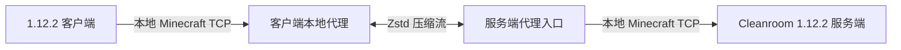

# ZstdNet 迁移至 Cleanroom 1.12.2 / Java 25 的评估

评估日期：2026-09-18。目标：为 Cleanroom 新增客户端和服务端模块，保留现有压缩代理架构。

**结论：可行。核心压缩转发的迁移复杂度中等，完整功能迁移的复杂度中高。主要成本来自 Minecraft 1.20/1.21 → 1.12.2 的加载器、握手、网络控制和界面适配；Java 25 本身不是主要障碍。现有 JAR 不能直接放入 Cleanroom 使用。**

本结论基于源码审查，不等于已经完成移植或验证运行。当前环境仅在 PATH 和常见 JDK 安装目录中发现 JDK 21；未构建 Cleanroom 模块，未执行现有 JUnit 测试，也未运行 Java 25 客户端／服务端联机测试。

## 1. 审查基线

| 项目 | 本次核对的版本 | 作用 |
| --- | --- | --- |
| ZstdNet | `main`, `c9161fbe7c90cd33f50b73fb4e73d4e9b179dd47`，模块版本 `1.4.7` | 以 1.20.1 Forge 为主要参考，对照 Fabric Mixin 与 1.21.1 NeoForge 测试 |
| Cleanroom | `19b9fa8f5042357efc9216f68204b368f7a03d90` | 核对目标加载器和 1.12.2 网络补丁 |
| CleanroomModTemplate | `935558879c66eede20591e0b21793cabcff3363b` | 核对构建、依赖打包和开发工具链 |
| zstd-jni | `v1.5.7-7`, `73bfa2722d168f948f619f88b29913ab4df8fe1d` | 核对原生库加载及打包限制 |

Cleanroom 当前 README 明确列出 Java 25+，源码采用 Java 25 toolchain。官方模板本次快照使用 Java 25、Unimined `1.4.36-kappa`、Gradle `9.7.0`、Cleanroom `0.6.10-alpha` 和 MCP `stable 39-1.12`。这些是审查时的源码配置，不能替代对最终选定发行版的验证；实施时应固定模板与加载器版本。

源码规模：1.20.1 Forge 主源码 24 个 Java 文件、7,863 行；共享主源码 4 个文件、1,000 行。行数包含注释和空行，不包含测试、JS Coremod 和资源，也没有将不同加载器的重复实现相加。

## 2. 为什么核心方案可以保留

`LocalZstdNet` 和 `ServerProxyRuntime` 合计约 3,749 行，主要使用 `java.net.Socket`、Java I/O、线程池及 `ZstdInputStream` / `ZstdOutputStream`。代理解析连接开头的握手等少量内容，之后主要按字节流转发，并没有逐个重写区块、实体和 Mod 游戏数据包。因此不需要把整套 1.20/1.21 游戏协议翻译成 1.12.2。

但是，客户端与后端仍须使用兼容的 Minecraft 和 Mod 协议。迁移此 Mod 不会让 1.20.1 客户端直接加入 1.12.2 服务端；“压缩通道可复用”也不代表所有握手处理都能原样复用。

| 部分 | 可复用程度 | 迁移工作与复杂度 |
| --- | --- | --- |
| VarInt、字节数组、流复制、计数、限速 | 高 | 基本是普通 Java；低 |
| TCP Zstd 流、连接管理、原始 UDP 转发 | 高，但需协议边界调整 | 替换平台路径／日志依赖，验证关闭与重连；中 |
| 历史统计、JSON、HTML 报告生成 | 高 | 共享代码不导入 Minecraft 类；适配存储目录与触发入口；低至中 |
| Mod 入口、配置、生命周期 | 低至中 | 现代 Forge API 改为 1.12.2 FML 生命周期及事件；中 |
| FML 握手、真实 IP、LAN 压缩切换 | 局部复用设计 | 重写注入点及控制消息；高 |
| 自动端口接管、LAN 广播 | 局部复用 | 适配启动时机、旧服务端属性与 LAN 开放逻辑；中高 |
| 客户端连接界面、HUD、命令 | 主要重写平台部分 | 现代 GUI／Brigadier API 不存在于 1.12.2；中高 |
| Gradle、元数据、Mixin、依赖打包 | 使用目标模板重建 | 不沿用现有 ForgeGradle / NeoForge 构建；中 |

“高复用”是对实现结构的判断，并非通过编译验证的复用比例。

## 3. 必须处理的兼容点

### 3.1 FML 握手标记是已确认的直接不兼容点

1.20.1 Forge 的 `LocalZstdNet.java:574` 中，`ensureForgeHandshakeSuffix()` 只保留 `\0FML2\0` / `\0FML3\0`，否则返回 `\0FML2\0`。因此把现有方法用于 1.12.2，会把输入的 `\0FML\0` 替换成错误标记。

Cleanroom 的 `C00Handshake.java.patch:28` 明确检测 `\0FML\0`，写出时也使用这个标记。必须为 1.12.2 保留正确后缀，避免破坏其他附加字段，并用完整 FML Mod 列表／注册表协商验证，不能只测试服务器列表 ping。

同一客户端文件 `:159` 的状态探测写死了协议号 `763`；新模块应使用 1.12.2 的 `340` 或目标版本提供的常量。状态查询对错误版本号可能宽容，但这不应成为实现依赖。主连接转发已经保留原始协议字段，不必对所有包做版本转换。

### 3.2 真实 IP 必须在握手信息被清理之前保存

`ServerProxyRuntime.java:835` 会把 `zstdnet-real-ip=...` 附加到握手 host。Cleanroom 的 `C00Handshake.java.patch:29` 随后执行 `ip.split("\0")[0]`，只留下主机名。

需要在 `C00Handshake.readPacketData` 读取原始字符串时捕获附加信息，再在 `NetHandlerHandshakeTCP` 处理连接时应用；只在处理完成后读 host 会丢失真实 IP。还要把现代 `Connection` 对象适配为 1.12.2 的 `NetworkManager`。

保留原有代理信任边界，并验证未受信任连接不能伪造标记；后端监听地址和网络暴露范围须与信任模型一致。真实 IP 转发并不提供正版身份验证。

### 3.3 Coremod 和注入必须重做

现有 Forge 模块的三个 JS Coremod 使用现代 `net.minecraftforge.coremod.api.ASMAPI`、现代 Minecraft 类名和方法描述符。Cleanroom 的 1.12.2 环境不能直接沿用这些脚本。

建议使用 Cleanroom 内置 Mixin，并从官方模板的 `mixin` 分支建立模块。仓库的 Fabric 实现可作为行为参考，但其目标类、方法签名和映射仍需全部核对。候选适配目标包括：

- `ConnectScreen` → `GuiConnecting`，连接改写时保留原始服务器地址和取消行为。
- `ClientIntentionPacket` → `C00Handshake`，保存原始 host。
- `ServerHandshakePacketListenerImpl` → `NetHandlerHandshakeTCP`。
- `Connection` → `NetworkManager`，处理地址和压缩设置。
- `ShareToLanScreen` → `GuiShareToLan`，配合 `IntegratedServer` 的 LAN 开放逻辑。

以上为 MCP 类级对应关系，不是已经验证的方法注入清单。客户端 Mixin 应单独声明，避免专用服加载 GUI 类。

### 3.4 控制通道与压缩切换时序需要重新验证

当前 `LanCompressionSync` 使用现代 Forge `SimpleChannel`，包含压缩协商、HUD 及报告消息。1.12.2 应改为 `SimpleNetworkWrapper` / `IMessage` / `IMessageHandler`，或显式实现兼容的 FML 通道。

Cleanroom 的 `FMLIndexedMessageToMessageCodec.java:109` 通过公开无参构造器创建消息。因此当前私有 `record` 消息不能直接作为旧式 `IMessage` 使用；需要适配消息类或自定义编解码器。旧版处理器默认在网络线程执行，应明确切回游戏线程，并将管线变更按 Netty 事件循环顺序执行。

必须校验压缩阈值协商顺序，尤其是 LAN 中加入前后是否已经安装压缩处理器。双方切换不一致会把长度、压缩标志或包 ID 误读，表现为登录失败或随机断线。优先考虑在登录阶段确定阈值，确实需要进入游戏后调整时再移植确认流程。

通道名选择简短的 `zstdnet`。报告字符串当前上限为 1 MiB；不能直接假设 1.12.2 字符串／CustomPayload 编码边界与现代版本相同。需核对所选 FML 封装的分片行为，必要时对报告分块，并保留长度限制和服务端管理员权限检查。

### 3.5 生命周期、自动端口与界面适配

`DedicatedServerAutoPort` 依赖现代 `DedicatedServerProperties` / `DedicatedServerSettings`，而目标源码使用 `PropertyManager`。自动接管必须发生在后端绑定端口之前，不能只在“服务器已启动”事件改端口。持久化配置时继续区分公网入口与内部后端端口，并处理端口占用、启动失败和重复启停。

`ClientProxyPublisher` 单个文件约 1,439 行，混合了连接控制、界面、HUD 和命令，是平台适配的主要工作量。需要改用 1.12.2 的 GUI、聊天组件、客户端命令和渲染事件；现代 Brigadier、`GuiGraphics`、`EditBox`、`Component` 不能直接复用。语言资源需适配 1.12.2 的 `.lang` 格式。建议在迁移时按连接、HUD、命令、LAN 页面拆分职责。

## 4. Java 25 与依赖的判断

**Java 语言层面风险低。** 现有源码以 Java 17/21 构建，使用 record、较新集合／字符串 API 等。既然目标限定 Cleanroom Java 25，就不需要为原版 Forge Java 8 降级这些语法；若将来要求同一个 JAR 同时支持旧 Forge，则是额外目标。

**构建工具必须一起升级。** 仓库现有 wrapper 是 Gradle 8.8，不适合作为 Java 25 上直接运行的构建基线。应采用经验证的 Cleanroom 模板工具链，并重新配置资源处理、重映射、运行任务和元数据，而不是只改 `minecraft_version` 与 `toolchain`。

**zstd-jni 有可行的接入路径，但需要实际验证原生加载。** 当前依赖是 `1.5.7-7`。官方 README 明确要求 Java 类不能被重命名、最小化或 relocate，因为 JNI 链接依赖类名。建议通过 Cleanroom 模板的 `contain` 和 `ContainedDeps` 机制保留原始 JAR 与 native 资源，不复制现代 Forge 的 JarJar 配置，也不要 relocate `com.github.luben.zstd`。

Java 25 需关注 JNI 的 native-access 策略。对常见 classpath 加载方式，可在目标启动配置核对 `--enable-native-access=ALL-UNNAMED`；这是 JVM 启动参数，不是 Mod 配置项。JDK 新版的相关告警不能直接判为 JNI 无法运行，仍应以目标 JDK、加载器和启动器组合测试。背景参考：[OpenJDK JEP 472](https://openjdk.org/jeps/472)。

本次 Cleanroom 源码已声明现代 Gson 和 SLF4J 依赖；不能套用“所有 1.12.2 环境都只有旧 Gson”的判断。应移除 `com.mojang.logging.LogUtils` 等现代 Minecraft 绑定，使用目标环境支持的日志入口，同时核对最终固定 Cleanroom 发行版的库版本。不要打包整套旧 Netty 与加载器自带版本竞争。

最低原生验证范围为 Windows x64 和 Linux x64：依赖发现、DLL/SO 提取、压缩／解压、重复建连和退出释放。macOS、ARM 和仓库已有的 Android 原生资源属于另行承诺的平台范围，不能由桌面测试推出兼容。

## 5. 推荐实施路径与工作量

建议新增 `mods/1.12.2/zstdnet-cleanroom`，保留现有模块。平台接入参考 1.20.1 Forge，Mixin 行为参考 Fabric；抽取可共享代理代码时将游戏目录、日志、生命周期和握手策略作为明确边界。

以下为一名熟悉 Forge 1.12.2、Mixin 与 Java 网络开发的开发者的粗估，不是已实测工期。假设目标仅 Cleanroom Java 25，优先桌面 Windows/Linux，不额外实现正版认证桥接或兼容原版 Forge Java 8。

| 阶段 | 范围与完成标准 | 估算 |
| --- | --- | --- |
| 最小可用版本 | 新模块可构建；客户端与专用服；手动 listen/target；正确 FML 握手；Zstd TCP；列表状态查询；固定压缩配置 | 3–5 人日 |
| 完整功能适配增量 | LAN、自动端口、真实 IP、控制消息、HUD／命令、统计报告、UDP 配置与界面 | 7–12 人日 |
| 发布前验证增量 | 双平台原生库、代表性整合包、长连接与大流量、重复启停、故障处理和缺陷修复 | 5–8 人日 |
| 合计 | 接近当前功能范围的可发布版本 | **15–25 人日，约 3–5 周** |

大型网络／登录／LAN 改写 Mod 的兼容问题可能使工期超出区间。若只需要自用专用服的压缩链路，可以止于最小版本；若要求完整复刻所有 UI、外部代理链与移动端支持，应单独增加预算。

现有项目推荐后端 `online-mode=false`，并将原版压缩阈值提高至 `1048576`。这属于当前架构的使用前提：原版加密或已经压缩的流量通常难以再有效压缩。1.12.2 移植应明确保留或重新设计认证部署方式，不承诺迁移会自动解决正版身份验证，也不能保证 README 中其他整合包的压缩比能在目标整合包重现。

## 6. 必须通过的验收

1. Java 25 下开发环境及生产重映射 JAR 均可启动，客户端和无图形专用服均可加载；zstd-jni 能从最终打包产物加载。
2. 1.12.2 FML 握手、Mod 列表和注册表协商完成；不仅能 ping，还能进服、加载区块、跨维度、重连。
3. 原版压缩阈值不同设置与 Zstd 通道组合正确；LAN 初次加入、已有玩家后的加入、阈值切换、大包和分段读写不出现解码错误。
4. 主机名、IPv4、IPv6、原有 NUL 后缀及真实 IP 信息正确保留；PROXY v2 的启用／关闭和受信任代理限制符合配置。
5. 手动端口、自动接管、端口冲突、LAN 重开、服务器停止和连接取消均正确释放 TCP/UDP 端口与线程。
6. HUD、控制消息和 30 日报告可用；报告大小、线程切换、无权限请求、无此 Mod 的对端处理符合产品约定。
7. 使用实际目标整合包测量原始／线上字节数、CPU、堆外内存、延迟和并发连接表现；UDP 保持原样转发，不宣称语音数据被 Zstd 压缩。

已有测试主要覆盖 UDP／语音配置、IPv6 地址、流量统计和 HTML 报告。1.21.1 NeoForge 下有 16 个 `@Test`，可作为迁移回归基础；它们没有替代上述 1.12.2 FML、Mixin 和 Java 25 端到端验证。

## 7. 可追溯源码

- [ZstdNet 构建配置](https://github.com/TheRealKamisama/zstdnet/blob/c9161fbe7c90cd33f50b73fb4e73d4e9b179dd47/mods/1.20.1/zstdnet-forge/build.gradle)：Java、依赖、共享源码与 JarJar。
- [客户端代理](https://github.com/TheRealKamisama/zstdnet/blob/c9161fbe7c90cd33f50b73fb4e73d4e9b179dd47/mods/1.20.1/zstdnet-forge/src/main/java/cn/tohsaka/factory/zstdnet/proxy/LocalZstdNet.java#L151)：协议探测及 `:516` 起的握手改写。
- [服务端代理](https://github.com/TheRealKamisama/zstdnet/blob/c9161fbe7c90cd33f50b73fb4e73d4e9b179dd47/mods/1.20.1/zstdnet-forge/src/main/java/cn/tohsaka/factory/zstdnet/server/ServerProxyRuntime.java#L764)：首包解析、IP 附加及后续流转发。
- [控制通道](https://github.com/TheRealKamisama/zstdnet/blob/c9161fbe7c90cd33f50b73fb4e73d4e9b179dd47/mods/1.20.1/zstdnet-forge/src/main/java/cn/tohsaka/factory/zstdnet/network/LanCompressionSync.java#L48)：压缩、HUD、报告消息。
- [Cleanroom README](https://github.com/CleanroomMC/Cleanroom/blob/19b9fa8f5042357efc9216f68204b368f7a03d90/README.md) 与 [加载器构建依赖](https://github.com/CleanroomMC/Cleanroom/blob/19b9fa8f5042357efc9216f68204b368f7a03d90/projects/cleanroom/build.gradle)：Java 25 和现代库版本。
- [Cleanroom 握手补丁](https://github.com/CleanroomMC/Cleanroom/blob/19b9fa8f5042357efc9216f68204b368f7a03d90/patches/minecraft/net/minecraft/network/handshake/client/C00Handshake.java.patch#L24)：FML 标记及 host 截断。
- [Cleanroom 消息构造](https://github.com/CleanroomMC/Cleanroom/blob/19b9fa8f5042357efc9216f68204b368f7a03d90/src/main/java/net/minecraftforge/fml/common/network/FMLIndexedMessageToMessageCodec.java#L109) 与 [线程模型说明](https://github.com/CleanroomMC/Cleanroom/blob/19b9fa8f5042357efc9216f68204b368f7a03d90/src/main/java/net/minecraftforge/fml/common/network/simpleimpl/SimpleNetworkWrapper.java#L105)。
- [官方模板构建](https://github.com/CleanroomMC/CleanroomModTemplate/blob/935558879c66eede20591e0b21793cabcff3363b/build.gradle) 与 [contain 说明](https://github.com/CleanroomMC/CleanroomModTemplate/blob/935558879c66eede20591e0b21793cabcff3363b/gradle/scripts/dependencies.gradle#L39)。
- [zstd-jni 打包限制](https://github.com/luben/zstd-jni/blob/73bfa2722d168f948f619f88b29913ab4df8fe1d/README.md#L52)。
